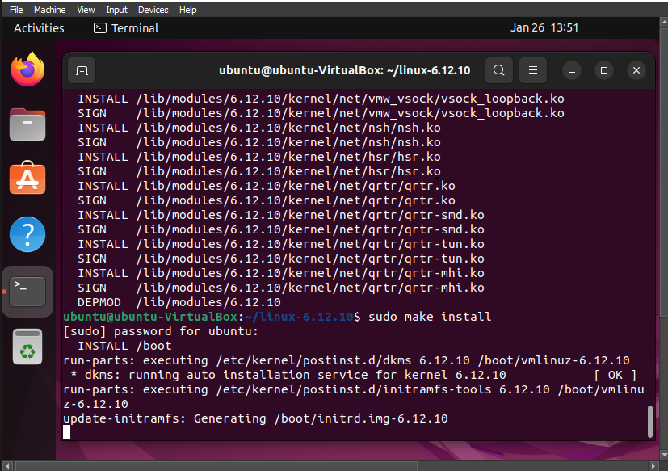
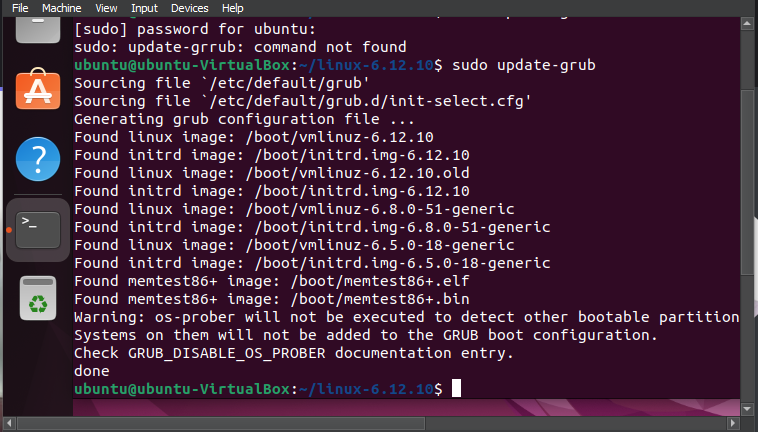
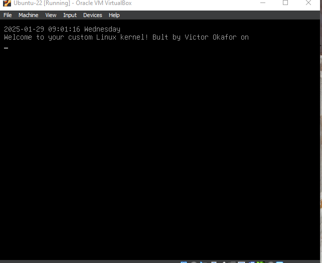
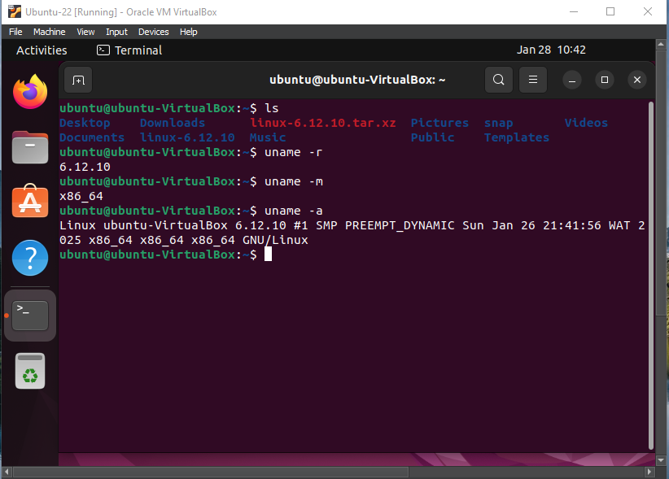
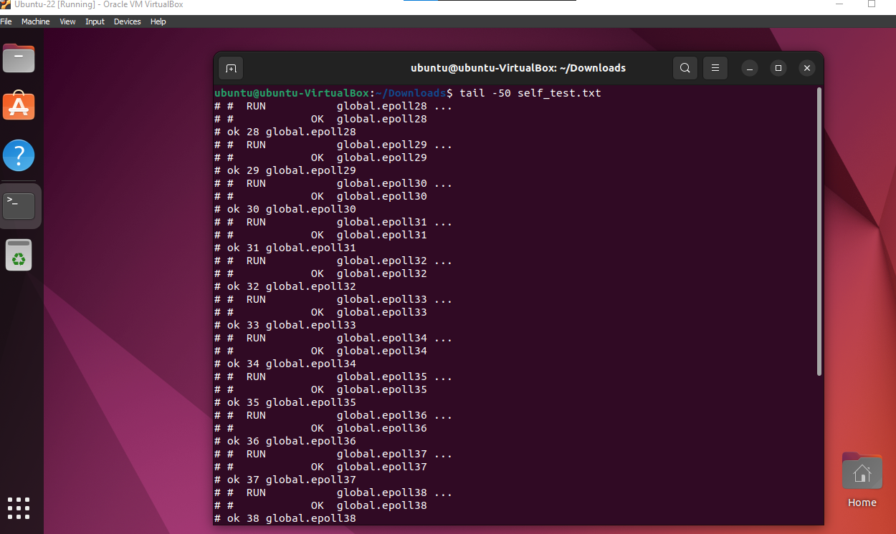
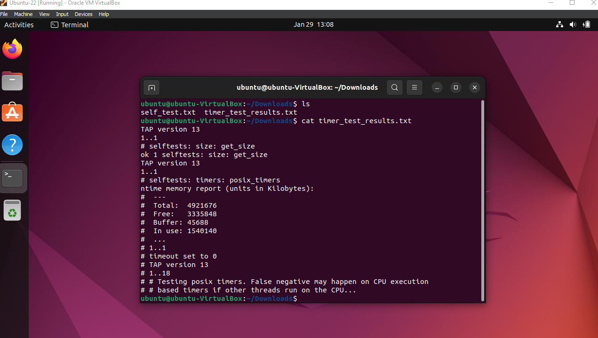

# RISC-V-as-a-First-Class-Citizen-in-KernelCI---Coding-Challenge
CNCF RISC-V as a First-Class Citizen in KernelCI - Coding Challenge


## Configure, Build, Install, Customize, and Test a Linux Kernel.

Download the kernel source:
```ssh
wget -c https://cdn.kernel.org/pub/linux/kernel/v6.x/linux-6.12.10.tar.xz

```

Prepare the build environment:
```ssh
make mrproper
```

Configure the kernel:
- Copy the current kernel configuration:
```ssh
cp /boot/config-$(uname -r) .config
```
- Customize the configuration by adding/removing
modules or features as necessary.
```ssh
make menuconfig
```
- Build the kernel:
  - compile the kernel:
```ssh
sudo make -j<number_of_cores>
```
  compiling the kernel was not successful with errors relating to certification to
  fix; run commands: 
  ```ssh
sudo scripts/config --set-str SYSTEM_TRUSTED_KEYS ""
sudo scripts/config --set-str SYSTEM_REVOCATION_KEYS ""
```
> NOTE: Other configurations: Ubuntu config file has full debugging. Makes an enormous kernel and takes twice as long to compile
```ssh
scripts/config --disable DEBUG_INFO_DWARF5
scripts/config --enable DEBUG_INFO_NONE
```
- Install the kernel:
  - install the modules
    ```ssh
    sudo make modules_install -j<number_of_cores>
    ```
  - Install the kernel, initramfs, and update GRUB bootloader:
    ```ssh
    sudo make install -j<number_of_cores>
    sudo update-grub
    ```
    
    
- Customize Boot Message:
  - navigate to the folder `/etc/grub.d`
  - edit the file `40_custom` to append your custom boot message
  - remove execution permissions from all files in the `/etc/grub.d` folder except `00_header`, `05_debian_theme`, and `40_custom` files
  - update the grub configuration with the command `sudo update-grub`
- Boot into the New Kernel
  - Reboot your system, your custom display message should be displayed, select the new kernel from the GRUB boot menu.
    
  - Verify the kernel version after booting:
    ```ssh
    uname -r
    ```
    
- Run Kernel test:
  - navigate to folder where you tests exists eg: `/linux-6.12.10/tools/testing/selftests/kselftest_install` confirm the file `kselftest-list.txt` exists and is not empty.
  - Run a subset of self-tests to ensure your kernel is functioning correctly:
      - I ran a single test targeting the `timers` function and also ran the full selftest:
      ```ssh
      $ ./run_kselftest.sh -c size -t timers:posix_timers > timer_test_results.txt 2>&1
      $ ./run_kselftest.sh > self_test.txt 2>&1
      ```
      
      
  
